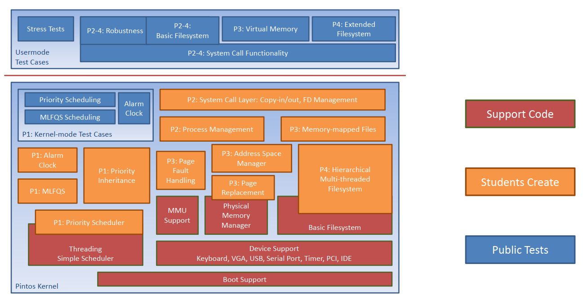

# Pintos

## About

PintOS is an open source instructional operating system kernel developed by Stanford University. PintOS provides complete documentation & modular projects to introduce students to the major concepts of operating systems development. The components of PintOS project is illustrated in the following figure.

The project is divided into four phases:

* P1: Threads
* P2: User Programs
* P3: Virtual Memory
* P4: File Systems

## Source Code

Source code is adopted from the open source project at [PintOS-OS](https://pintos-os.org/), we will try to keep this repository in sync with the official repository at [PintOS-OS Official Repository](https://pintos-os.org/cgi-bin/gitweb.cgi?p=pintos-anon;a=summary).

Last adopted commit details:

* Comment: Small bug fixes in gdb macros master
* Date: Tue, 12 Jan 2021 23:28:24 +0000 (15:28 -0800)
* URL: [85da529909adac7ed00861d259001b124cd5b54f](https://pintos-os.org/cgi-bin/gitweb.cgi?p=pintos-anon;a=commit;h=85da529909adac7ed00861d259001b124cd5b54f)

To download the most recent code from [PintOS-OS](https://pintos-os.org/) directly, use the following [link](https://pintos-os.org/cgi-bin/gitweb.cgi?p=pintos-anon;a=snapshot;h=HEAD).

## Installation Guidelines

To install PintOS please use the guidelines listed at the [installation document](Installation.md).

## Sessions' Videos

Here's a list of sessions I made (in Arabic) for Alexandria University, explaining PintOS & its phases requirements:

1. [Phase 1 Requirements](https://youtu.be/RLx_0nnEjaM)
2. [Phase 2 Requirements](https://youtu.be/bFUmvVgmbOs)
